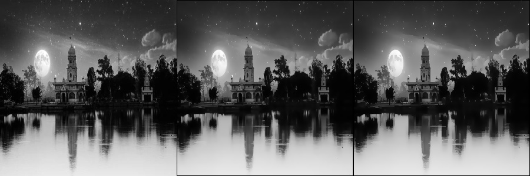
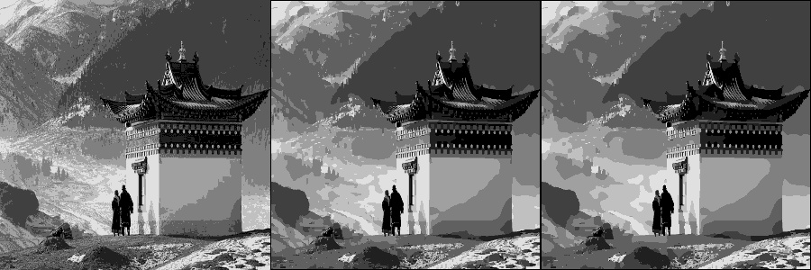
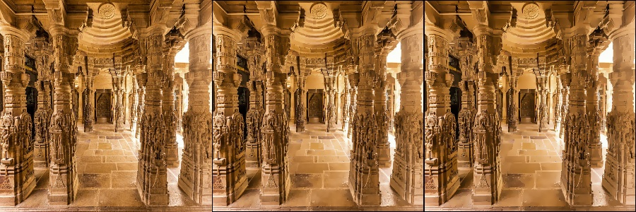
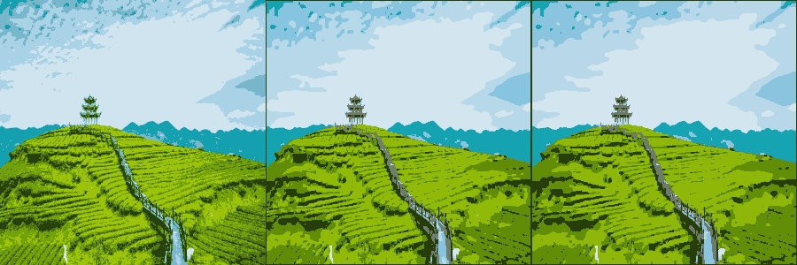

# Image-processing is interesting 

### XDoG

`σ = 0.5 | ε = 0.5046 | p = 1.5 | φ = 9.0`

`σ = 0.5 | ε = 0.7046 | p = 1.5 | φ = 10.0`

### Bilateral and Quantization (Grayscale and Colored images)

`iteration :4 | bilateral (spatial filtersize (7,7) , radial stddev 10)  image(300,300) | iter=2 | iter=4`

`quantization( levels =8 ) | bilateral((7,7) ,20) | image(300,300) | iter=2 | iter=4`

`iteration :4 | bilateral (spatial filtersize (7,7) , radial stddev 10)  image(300,300) | iter=2 | iter=4`

`quantization( levels =8 ) | bilateral((7,7) ,20) | image(300,300) | iter=2 | iter=4`

Imp Papers used :

1. [XDoG: AneXtended difference-of-Gaussians compendium including advanced image stylization](https://users.cs.northwestern.edu/~sco590/winnemoeller-cag2012.pdf)
2. [Image Abstraction by Structure Adaptive Filtering](https://hpi.de/fileadmin/user_upload/fachgebiete/doellner/publications/2008/KD08b/jkyprian-tpcg2008.pdf)
