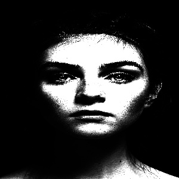
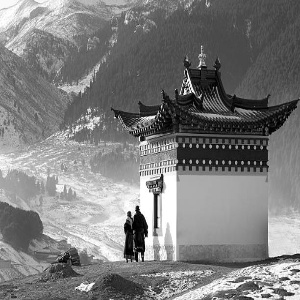

# Image-processing is interesting 

### XDoG

`σ = 0.5 | ε = 0.5046 | p = 1.5 | φ = 9.0`

`σ = 0.5 | ε = 0.7046 | p = 1.5 | φ = 10.0`

`4 iterations ,spatial filter =(7,7)  , radial filter(std dev)=10 | image(300,300) | iter=2 | iter=4`

`4 iterations ,spatial filter =(7,7)  , radial filter(std dev)=20 | image(300,300) | iter=2 | iter=4`

`quantization( levels =8 ) | used : image and bilateral output for spatial filter (7,7) , radial filter(std dev) 20`

